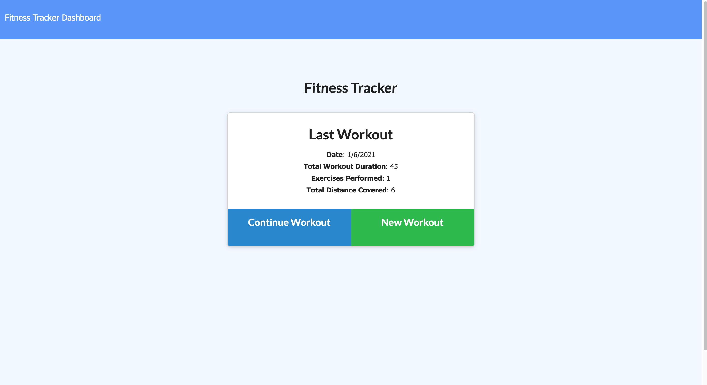
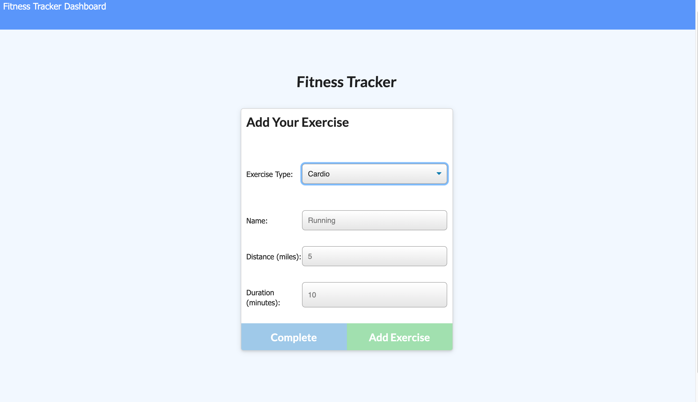
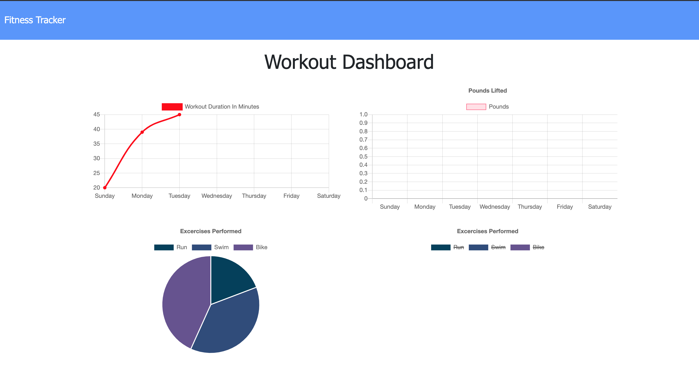

# Fitness-Tracker

## Description

This application is a workout tracker designed to be able to view, create, and track daily workouts. It allows the user to log multiple exercises in a workout on a given day. It also allows the user to be able to track the name, type, weight, sets, reps, and duration of exercise. If the exercise is a cardio exercise, the user is able to track their distance traveled.

## Screen Captures

[Deployed App](https://trackworkout.herokuapp.com/)

[GitHub Repo](https://github.com/jasandper/Fitness-Tracker)

## Contact

[Jason Perez](https://github.com/jasandper)
